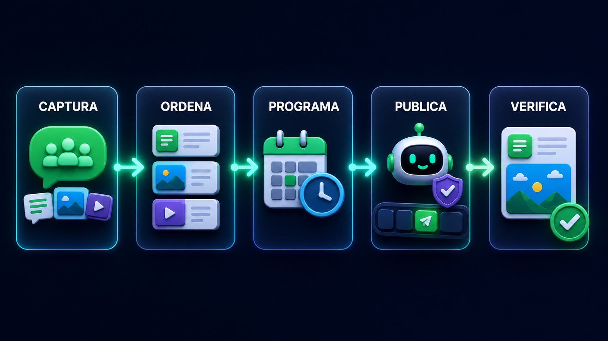
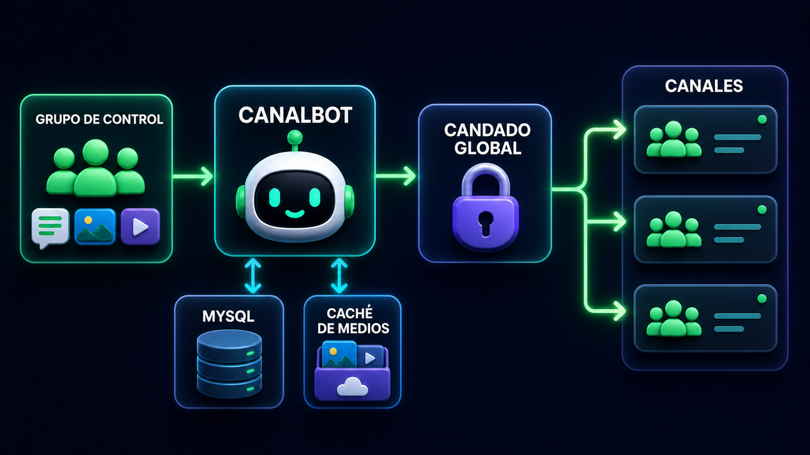

<div align="center">

# CanalBot

**Convierte un grupo de WhatsApp en el centro editorial de tus canales.**

Captura contenido, ordénalo, prográmalo y publícalo con ritmo, sin depender de un panel externo.

[](CHANGELOG.md)
[](https://nodejs.org/)
[](https://www.mysql.com/)
[](LICENSE)

</div>


CanalBot es un programador de contenido para canales de WhatsApp. Desde un grupo privado de control, tu equipo puede preparar textos, imágenes, videos, campañas diarias y stocks de stickers; CanalBot conserva el orden y los publica en el canal seleccionado.

Está pensado para creadores, comunidades y equipos editoriales que quieren trabajar desde WhatsApp, pero necesitan más control que el botón de publicar: colas persistentes, horarios, separación por canal, estados visibles y protección contra envíos simultáneos.

> [!IMPORTANT]
> CanalBot trabaja mediante Baileys, una integración no oficial con WhatsApp. Antes de usarlo en un canal importante, pruébalo con un número y un canal de ensayo.

## Contenido

- [Lo que puedes hacer](#lo-que-puedes-hacer)
- [Cómo funciona](#cómo-funciona)
- [Inicio rápido](#inicio-rápido)
- [Tu primera cola](#tu-primera-cola)
- [Formas de publicar](#formas-de-publicar)
- [Referencia de comandos](#referencia-de-comandos)
- [Configuración](#configuración)
- [Seguridad operativa](#seguridad-operativa)
- [Operación y diagnóstico](#operación-y-diagnóstico)
- [Arquitectura](#arquitectura)
- [Desarrollo](#desarrollo)
- [Límites conocidos](#límites-conocidos)

## Lo que puedes hacer

| Flujo | Para qué sirve |
|---|---|
| **Publicación rápida** | Agrega un texto, una imagen o un video directamente a la cola. |
| **Captura mixta** | Envía varios textos, imágenes y videos en el orden final y programa toda la tanda. |
| **Carga por frases** | Convierte un mensaje separado por `;` en varias publicaciones consecutivas. |
| **Campañas diarias** | Mantén una secuencia independiente que publica una pieza al día, a una hora y zona horaria definidas. |
| **Stock de stickers** | Guarda stickers por canal y envíalos individualmente o en bloques controlados. |
| **Operación multicanal** | Cambia de canal sin mezclar colas, campañas, ritmos ni stocks. |

Además:

- Conserva colas y estados en MySQL para sobrevivir reinicios.
- Acepta intervalos en minutos, horas o días.
- Permite pausar y reanudar sin perder el contenido pendiente.
- Limita los comandos editoriales a administradores del grupo de control.
- Serializa todas las publicaciones con un candado global persistente.
- Marca los envíos interrumpidos para revisión en lugar de duplicarlos automáticamente.



## Cómo funciona



1. Un administrador activa un único grupo de control.
2. El grupo selecciona el canal sobre el que quiere trabajar.
3. Los mensajes enviados durante una captura se guardan en el orden recibido.
4. MySQL conserva la cola, los horarios y el estado de cada publicación.
5. El candado global deja pasar un solo envío a la vez, incluso si existen varios canales o campañas.

## Inicio rápido

### Requisitos

- Node.js 20 o superior.
- MySQL 8 o compatible.
- Bash, disponible en Linux, macOS o WSL.
- Un número de WhatsApp que sea administrador de los canales de destino.
- Un grupo privado que funcionará como centro de control.

### 1. Descarga e instala

```bash
git clone https://github.com/roynezstudios-rgb/canalbot.git
cd canalbot
npm install
cp .env.example .env
```

### 2. Prepara MySQL

Ejecuta este ejemplo con un usuario administrador de MySQL y cambia la contraseña:

```sql
CREATE DATABASE canalbot CHARACTER SET utf8mb4 COLLATE utf8mb4_unicode_ci;
CREATE USER 'canalbot'@'127.0.0.1' IDENTIFIED BY 'EXAMPLE';
GRANT ALL PRIVILEGES ON canalbot.* TO 'canalbot'@'127.0.0.1';
FLUSH PRIVILEGES;
```

Actualiza las credenciales en `.env`:

```env
MYSQL_HOST=127.0.0.1
MYSQL_PORT=3306
MYSQL_DATABASE=canalbot
MYSQL_USER=canalbot
MYSQL_PASSWORD=EXAMPLE
```

Aplica el esquema y comprueba el proyecto:

```bash
npm run migrate
npm test
npm run doctor
```

### 3. Vincula WhatsApp

Con código QR:

```bash
npm run pair:qr
```

El QR aparece en la terminal y también se guarda en `data/latest-qr.png`.

O usa un código de vinculación. Escribe el número con código de país, sin `+`, espacios ni guiones:

```bash
npm run pair:code -- --phone 5215551234567
```

### 4. Habilita e inicia

Después de vincular el número, revisa `.env` y cambia:

```env
WA_ENABLE_CONNECT=true
CANALBOT_PUBLISH_ENABLED=true
```

Inicia el proceso:

```bash
npm start
```

Para una instalación más guiada, consulta [Instalar CanalBot](docs/INSTALACION.md).

## Tu primera cola

En el grupo que usarás como control:

```text
!canalbot on
!ac https://whatsapp.com/channel/INVITE Mi Canal
!pub iniciar
```

Ahora envía textos, imágenes y videos en el orden en que deben aparecer. Cuando termines:

```text
!pub fin
!pub cada 2h
!pub activar
!pub estado
```

CanalBot agregará la tanda al final de la cola del canal seleccionado y publicará una pieza cada dos horas. Puedes detenerla con `!pub pausar`; el contenido y su orden se conservan.

## Formas de publicar

### Una publicación rápida

```text
!pr Hoy estrenamos nuevo contenido ✨
```

También puedes adjuntar una imagen o un video y escribir `!pr` seguido del texto que usarás como descripción.

### Varias frases de una vez

```text
!po Primera idea ; Segunda idea ; Tercera idea
```

Cada frase se convierte en una publicación. Una tanda admite hasta 30 frases y usa el intervalo actual del grupo de control.

### Una cola mixta

```text
!pub iniciar
<envía textos, imágenes y videos>
!pub fin
!pub cada 15m
!pub activar
```

El intervalo mínimo es de cinco minutos. Puedes usar `m`, `h` o `d`, por ejemplo `15m`, `2h` o `1d`. Si cambias el ritmo, CanalBot reorganiza únicamente lo que todavía no se ha publicado.

### Una campaña diaria

```text
!camp crear FraseDelDia 09:00 America/Mexico_City
!camp iniciar FraseDelDia
<envía la secuencia de textos, imágenes y videos>
!camp fin
!camp activar FraseDelDia
!camp estado FraseDelDia
```

La campaña publica una pieza por día a la hora configurada. Si se queda sin contenido, espera; cuando agregas nuevas piezas, retoma la secuencia en el siguiente horario diario.

### Stickers individuales o por bloques

Primero crea el stock:

```text
!st iniciar
<envía los stickers>
!st fin
!st prueba
```

`!st prueba` programa un solo sticker para un minuto después. Cuando confirmes que llegó correctamente, elige un ritmo:

```text
!st cada 2h
!st activar
```

O publica bloques de hasta cinco stickers:

```text
!st bloque 5 15s 1h
!st activar
```

Ese ejemplo envía hasta cinco stickers, deja 15 segundos entre cada uno y espera una hora antes del siguiente bloque. El stock se usa una sola vez: no se recicla y se pausa al agotarse o si ocurre un fallo.

## Referencia de comandos

Los comandos editoriales comienzan con `!` y, dentro de un grupo, solo pueden ejecutarlos administradores.

### Grupo de control y canales

| Comando | Acción |
|---|---|
| `!canalbot on` | Convierte el grupo actual en el único grupo de control activo. |
| `!canalbot off` | Desactiva el grupo de control sin borrar sus colas. |
| `!canalbot estado` | Muestra qué grupo controla CanalBot. |
| `!ay` | Muestra la ayuda rápida dentro de WhatsApp. |
| `!ac <enlace o JID> [nombre]` | Agrega un canal y lo selecciona. |
| `!cn` | Lista los canales configurados. |
| `!ca <nombre o JID>` | Selecciona el canal activo. |
| `!in <minutos>` | Define el intervalo para publicaciones rápidas, entre 5 y 1440 minutos. |
| `!co` | Muestra pendientes, publicando, publicadas, fallidas y canceladas. |

### Publicaciones

| Comando | Acción |
|---|---|
| `!pr <texto>` | Agrega una publicación a la cola actual. También acepta imagen o video adjunto. |
| `!po texto1 ; texto2` | Agrega entre 2 y 30 textos en una sola tanda. |
| `!pub iniciar` | Abre una captura ordenada de textos, imágenes y videos. |
| `!pub fin` | Cierra la captura y guarda la tanda. |
| `!pub cada 2h` | Define el ritmo de la cola mixta. |
| `!pub activar` | Reanuda las publicaciones del canal activo. |
| `!pub pausar` | Pausa la cola sin borrar contenido. |
| `!pub estado` | Muestra ritmo, pendientes, próxima publicación, última publicación y fallos. |

### Campañas

| Comando | Acción |
|---|---|
| `!camp crear Nombre 09:00 [ZonaHoraria]` | Crea o actualiza una campaña diaria. |
| `!camp iniciar Nombre` | Abre la captura de contenido para esa campaña. |
| `!camp fin` | Cierra la captura actual. |
| `!camp activar Nombre` | Activa la campaña. |
| `!camp pausar Nombre` | Pausa la campaña sin perder la secuencia. |
| `!camp estado [Nombre]` | Muestra una campaña o lista todas las del canal activo. |

### Stickers

| Comando | Acción |
|---|---|
| `!st iniciar` / `!st fin` | Abre o cierra la captura de stickers. |
| `!st prueba` | Programa un sticker de prueba para un minuto después. |
| `!st cada 2h` | Configura publicaciones individuales. |
| `!st bloque 5 15s 1h` | Configura bloques de 1 a 5 stickers. |
| `!st activar` / `!st pausar` | Inicia o detiene el stock seleccionado. |
| `!st estado` | Muestra stock, enviados, modo y estado. |

La guía diaria con ejemplos está en [Operar CanalBot](docs/CANALBOT_OPERACION.md).

## Configuración

El archivo [`.env.example`](.env.example) contiene todas las variables disponibles. Estas son las más importantes:

| Variable | Valor de ejemplo | Función |
|---|---:|---|
| `WA_ENABLE_CONNECT` | `false` | Impide que el proceso principal se conecte hasta que termines la configuración. |
| `WA_AUTH_DIR` | `auth/main` | Guarda localmente la sesión vinculada de WhatsApp. |
| `WA_LOG_LEVEL` | `info` | Controla el nivel de logs. |
| `WA_MEDIA_CACHE_DIR` | `data/media-cache` | Guarda medios pendientes de publicación. |
| `CANALBOT_ENABLE` | `true` | Habilita los comandos de CanalBot. |
| `CANALBOT_PUBLISH_ENABLED` | `false` | Habilita el procesador automático de la cola principal. |
| `CANALBOT_GLOBAL_SEND_DELAY_SECONDS` | `15` | Añade una pausa después de cada publicación global. |
| `CANALBOT_GLOBAL_SEND_LEASE_SECONDS` | `300` | Reserva el candado de publicación durante envíos largos. |
| `CANALBOT_OUTBOUND_MIN_DELAY_MS` | `2500` | Separa mensajes salientes hacia el mismo chat. |
| `CANALBOT_MAX_CAPTURE_ITEMS` | `200` | Limita el tamaño de una captura mixta o campaña. |
| `CANALBOT_MAX_MEDIA_BYTES` | `67108864` | Limita cada archivo a 64 MiB. |
| `CANALBOT_CREATOR_MENTIONS_ENABLED` | `true` | Permite una mención ocasional al canal del creador; puedes desactivarla. |
| `MYSQL_*` | varios | Configura la conexión persistente con MySQL. |

No publiques `.env`, `auth/`, `data/` ni `logs/`. El `.gitignore` ya excluye esas rutas porque pueden contener credenciales, sesiones o contenido local.

## Seguridad operativa

CanalBot aplica varias barreras para reducir publicaciones accidentales:

- **Dos habilitaciones iniciales.** El ejemplo comienza con la conexión y la cola automática desactivadas.
- **Un solo grupo de control.** Los comandos de otros grupos quedan bloqueados mientras exista un control activo.
- **Permisos de administrador.** Los miembros normales del grupo no pueden programar contenido.
- **Cola persistente.** MySQL conserva orden, estado, horario, canal y resultado técnico.
- **Candado global.** Colas, campañas y stickers comparten una reserva en base de datos; no se envían dos publicaciones al mismo tiempo.
- **Protección ante reinicios.** Un trabajo interrumpido durante el envío se marca como fallido y requiere revisión.
- **Sin reintentos ciegos.** Un fallo en el stock de stickers pausa el flujo y cancela lo que seguía en ese bloque.
- **Trazabilidad.** Las acciones relevantes se registran en `wa_actions_log`.

> [!CAUTION]
> No actives la publicación real hasta verificar el canal, el número vinculado y el contenido pendiente. Usa primero un canal de prueba y confirma visualmente cada tipo de medio.

## Operación y diagnóstico

Desde la terminal:

```bash
npm run status
npm run cli -- channels
npm run cli -- queue queued 20
npm run doctor
npm run pair:diagnose
```

| Comando | Resultado |
|---|---|
| `npm run status` | Sesión más reciente, canales habilitados y publicaciones pendientes. |
| `npm run cli -- channels` | Canales, estado y modo de publicación. |
| `npm run cli -- queue [estado] [límite]` | Elementos de cola, con un máximo de 100. |
| `npm run doctor` | Conectividad con MySQL y configuración principal. |
| `npm run pair:diagnose` | Diagnóstico del proceso de vinculación. |
| `npm run migrate` | Aplica en orden las migraciones `sql/NNN_*.sql`. |

## Arquitectura

```text
src/
├── wa/                 conexión con WhatsApp y comandos del grupo
├── queue/              publicación programada y candado global
├── publications/       captura mixta e intervalos
├── campaigns/          campañas diarias y zonas horarias
├── stickers/           pruebas, stock individual y bloques
├── creatorMention/     atribución opcional del proyecto
├── db/                 persistencia y operaciones MySQL
├── config.js           variables de entorno y valores predeterminados
└── index.js            arranque y cierre controlado
```

Las migraciones viven en `sql/`. Los archivos multimedia pendientes se guardan bajo `data/media-cache/`, mientras que las credenciales de la sesión se guardan bajo `auth/`. Ninguna de esas rutas se versiona.

## Desarrollo

Instala las dependencias bloqueadas y ejecuta las pruebas:

```bash
npm ci
npm test
```

La suite unitaria cubre intervalos, campañas, contenido multimedia de la cola, configuración, menciones y políticas de stickers. Las pruebas que requieren MySQL se ejecutan por separado:

```bash
npm run test:db
```

Usa una base de datos de prueba para `test:db`, ya que esa suite crea y actualiza registros en las tablas de CanalBot.

Si quieres contribuir:

1. Crea una rama desde `main`.
2. Mantén los cambios enfocados.
3. Ejecuta `npm test`.
4. Abre un pull request explicando el caso de uso y la validación realizada.

## Límites conocidos

- CanalBot no puede borrar de forma fiable una publicación que ya es visible en un canal. Hazlo desde la app oficial de WhatsApp.
- Para canales `@newsletter`, la respuesta de Baileys confirma que WhatsApp aceptó el envío, pero no sustituye la revisión visual, especialmente con imágenes, videos y stickers.
- La publicación multimedia depende de un parche específico para `@whiskeysockets/baileys` `7.0.0-rc13`; `prestart` y `pretest` verifican y aplican ese parche.
- Los cambios de WhatsApp o Baileys pueden romper la compatibilidad sin previo aviso.
- El proyecto no incluye un panel web: la operación ocurre desde el grupo de control y la terminal.

## Documentación

- [Instalación](docs/INSTALACION.md)
- [Operación de colas, campañas y stickers](docs/CANALBOT_OPERACION.md)
- [Historial de cambios](CHANGELOG.md)

## Crédito

CanalBot es gratuito. De forma predeterminada puede publicar una mención ocasional al canal del creador como apoyo al proyecto. Si no deseas esa atribución, establece `CANALBOT_CREATOR_MENTIONS_ENABLED=false` en `.env`.

## Licencia

CanalBot se distribuye bajo la [Licencia MIT](LICENSE).
